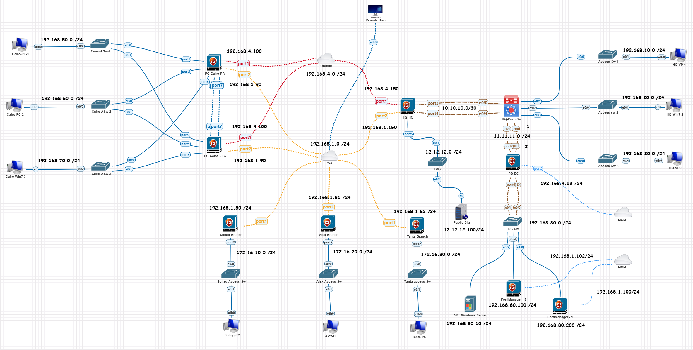
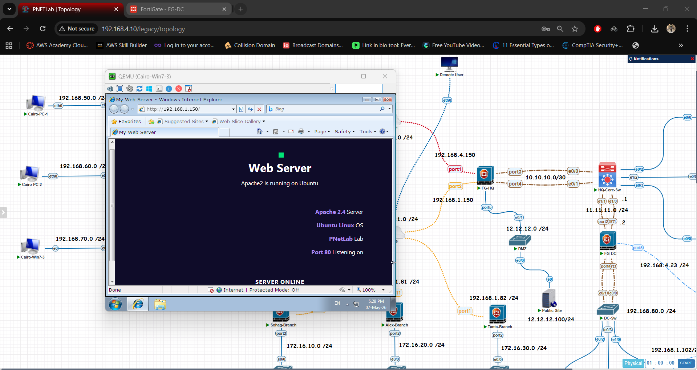
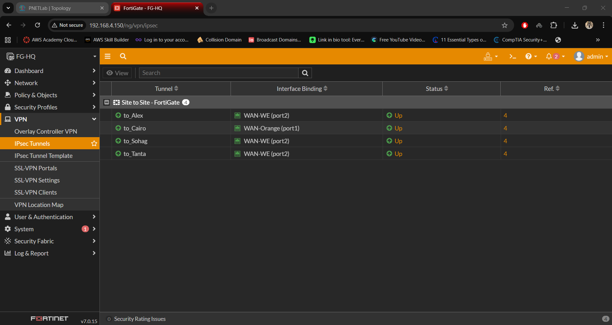
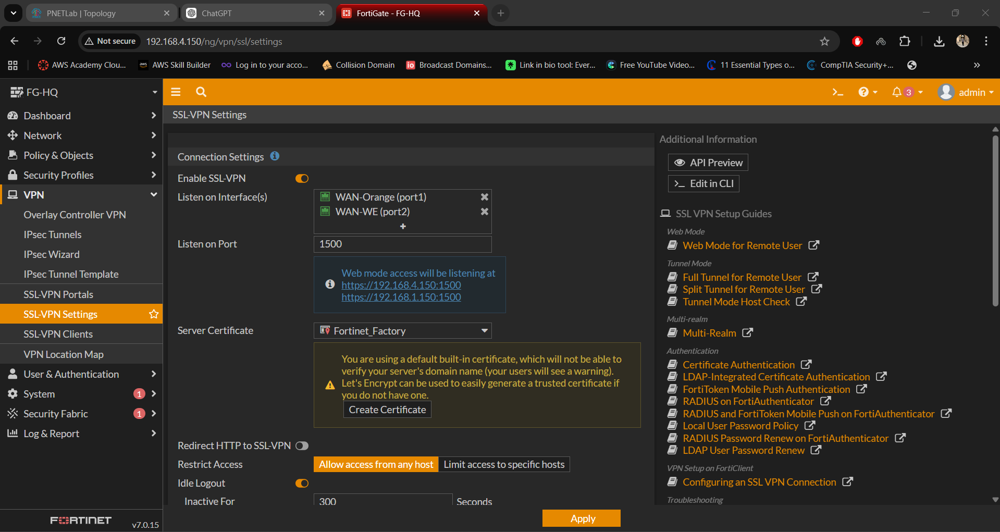
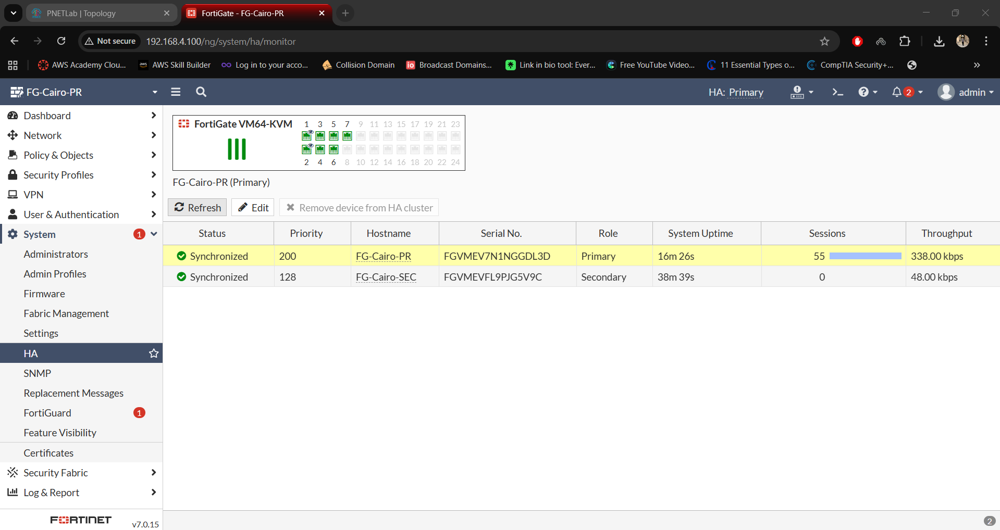
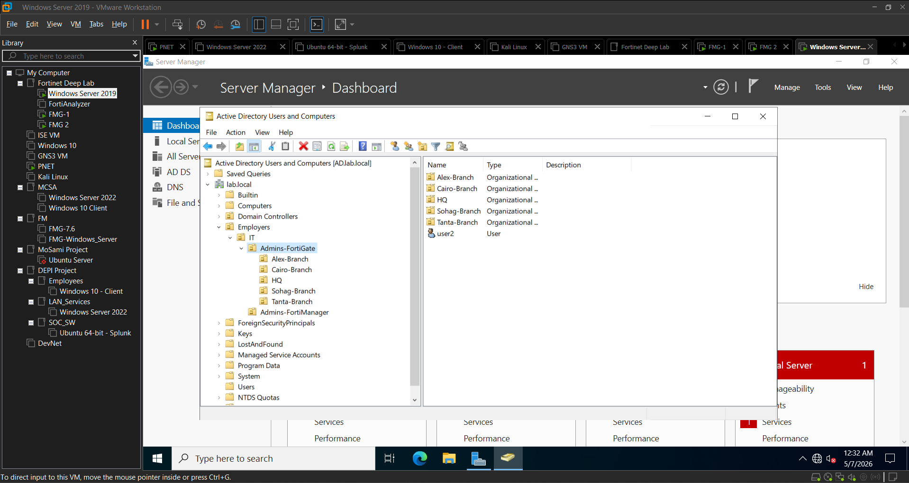
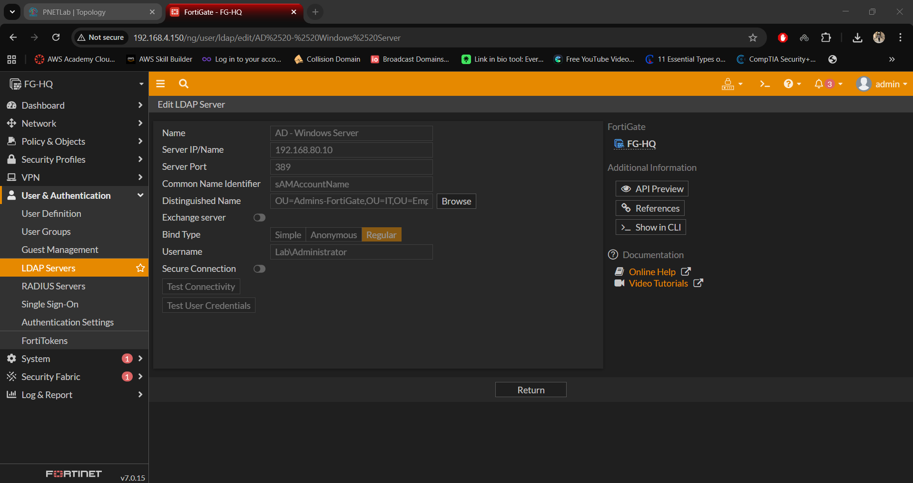
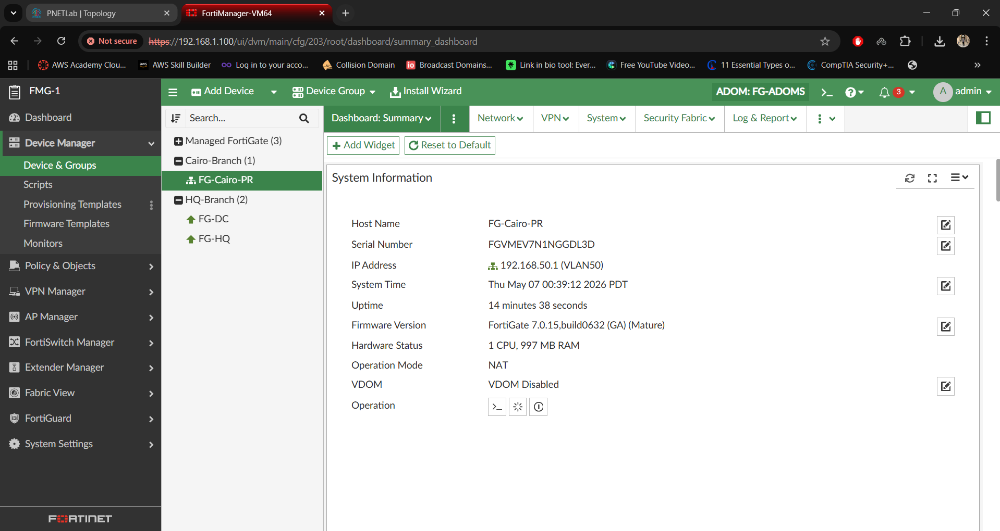
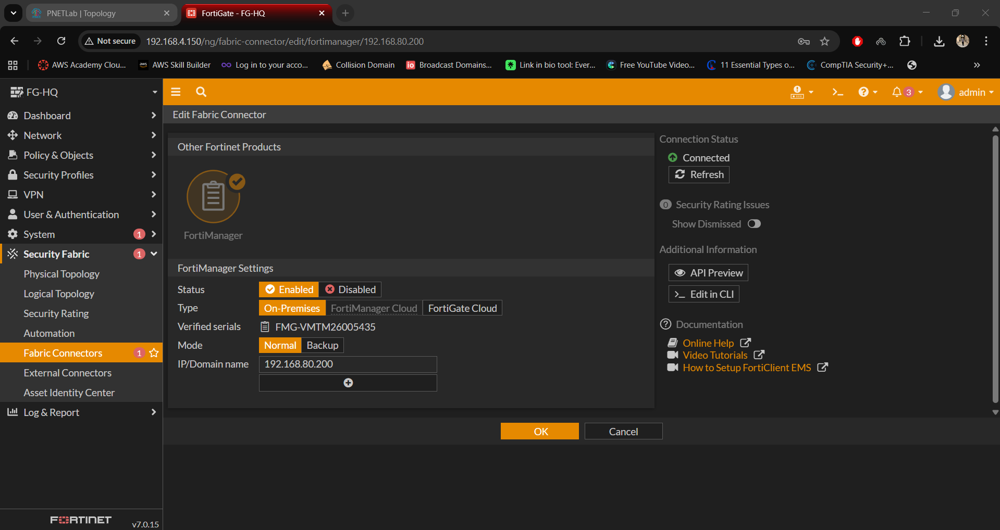

# Multi-Site Enterprise Network (FortiGate + SD-WAN + VPN + AD + HA + Security)

## 🖼️ Network Topology

---

## 📌 Overview

This project simulates a real-world enterprise network connecting multiple branches to a central HQ using secure, scalable, and enterprise-grade technologies.

It demonstrates advanced networking and security concepts including **SD-WAN, VPN, High Availability (HA), Zero Trust principles, network segmentation, and centralized identity management using Active Directory**.

---

## 🎯 Business Objective

- Ensure secure communication between branches
- Minimize downtime using redundancy (SD-WAN + HA)
- Protect internal resources using segmentation and firewall policies
- Centralize authentication and access control

---

## 🏗️ Architecture

- 🏢 HQ (Headquarters) acting as central hub
- 🌍 Branches: Cairo, Alexandria, Tanta, Sohag
- 🌐 Dual ISP (Orange + WE) using SD-WAN
- 🔐 IPsec VPN tunnels (Hub-and-Spoke topology)
- 🔐 SSL VPN for remote users
- 🔗 LACP between FortiGate and Core Switch in HQ
- 🔄 High Availability (HA) in Cairo Branch
- 🌍 DMZ hosting public-facing server
- 🛠️ Dedicated Management network

---

## ⚙️ Technologies Used

- FortiGate NGFW
- SD-WAN (Dual ISP)
- IPsec VPN (Site-to-Site)
- SSL VPN (Remote Access)
- High Availability (Active-Passive)
- Active Directory (Windows Server)
- LDAP Authentication

---

## 🌐 Key Features

### 🔹 SD-WAN

- Load balancing between ISPs
- Automatic failover
- SLA-based path selection

### 🔹 VPN Connectivity

- Secure tunnels between HQ and branches
- Hub-and-spoke design
- Controlled inter-site traffic

### 🔹 SSL VPN (Remote Access)

- Secure remote access over the internet
- Authentication using Active Directory
- Access to Data Center and DMZ resources
- Encrypted communication using SSL/TLS

### 🔹 High Availability (HA)

- Active-Passive deployment in Cairo
- Session synchronization
- Automatic failover

### 🔹 Security Policies

- Public server exposed via DMZ
- Restricted access from selected branches
- East-West and North-South traffic control

### 🔹 Identity-Based Access

- Admin authentication via Active Directory
- Role-Based Access Control (RBAC)

### 🔹 Link Aggregation (LACP)

- LACP (802.3ad) configured between FortiGate and Core Switch in HQ
- Provides link redundancy and increased bandwidth
- Ensures continuous connectivity in case of link failure

---

## 🧠 Security Architecture (Zero Trust Approach)

- No implicit trust between networks
- All traffic inspected via firewall policies
- Identity-based access enforcement
- Segmentation between Users / Servers / Management

---

# 🌐 IP Addressing & Network Design

---

## 🏢 HQ (FG-HQ)

### Interfaces

| Interface | IP Address       | Description  |
| --------- | ---------------- | ------------ |
| port1     | 192.168.4.150/24 | WAN (Orange) |
| port2     | 192.168.1.150/24 | WAN (WE)     |
| port3     | 10.10.10.1/30    | Core Link    |
| port5     | 12.12.12.1/24    | DMZ          |

### VLANs

| VLAN | Subnet          | Purpose |
| ---- | --------------- | ------- |
| 10   | 192.168.10.0/24 | Users   |
| 20   | 192.168.20.0/24 | IT      |
| 30   | 192.168.30.0/24 | Servers |

---

## 🏙️ Cairo Branch (HA Pair)

### WAN Interfaces

| Interface | Device       | IP Address       | Description |
| --------- | ------------ | ---------------- | ----------- |
| port1     | FG-Cairo-PRI | 192.168.4.100/24 | Orange      |
| port2     | FG-Cairo-PRI | 192.168.1.90/24  | WE          |
| port1     | FG-Cairo-SEC | 192.168.4.100/24 | Orange (HA) |
| port2     | FG-Cairo-SEC | 192.168.1.90/24  | WE (HA)     |

### VLANs

| VLAN | Subnet          | Gateway      |
| ---- | --------------- | ------------ |
| 50   | 192.168.50.0/24 | 192.168.50.1 |
| 60   | 192.168.60.0/24 | 192.168.60.1 |
| 70   | 192.168.70.0/24 | 192.168.70.1 |

### Access Layer

- SW1 → VLAN 50
- SW2 → VLAN 60
- SW3 → VLAN 70

---

## 🏢 Alexandria Branch

### Interfaces

| Interface | IP Address      | Description |
| --------- | --------------- | ----------- |
| port1     | 192.168.1.81/24 | WAN         |
| port2     | 172.16.20.1/24  | LAN         |

---

## 🏢 Tanta Branch

### Interfaces

| Interface | IP Address      | Description |
| --------- | --------------- | ----------- |
| port1     | 192.168.1.82/24 | WAN         |
| port2     | 172.16.30.1/24  | LAN         |

---

## 🏢 Sohag Branch

### Interfaces

| Interface | IP Address      | Description |
| --------- | --------------- | ----------- |
| port1     | 192.168.1.80/24 | WAN         |
| port2     | 172.16.10.1/24  | LAN         |

---

## 🌐 WAN Networks

- Orange → 192.168.4.0/24
- WE → 192.168.1.0/24

---

## 🌍 DMZ Network

| Network       | Device        |
| ------------- | ------------- |
| 12.12.12.0/24 | Public Server |
| Server IP     | 12.12.12.100  |
| Gateway       | 12.12.12.1    |

---

## 🔐 VPN Design

- IPsec Site-to-Site
- Hub-and-Spoke (HQ as hub)
- AES256 encryption
- Centralized routing via HQ

---

## 🔐 SSL VPN Design

- Type: Remote Access (SSL VPN)
- Authentication: Active Directory (LDAP)
- Access Scope:
  - Data Center (Internal Servers)
  - DMZ (Web Server access)

### 🔹 User Access Flow

1. User connects to SSL VPN portal
2. Authenticated using AD credentials
3. Assigned IP from VPN pool
4. Access granted based on firewall policies

---

### 🔹 SD-WAN

- Load balancing between ISPs
- Automatic failover
- SLA-based path selection

### SD-WAN Policies

| Rule | Traffic  | Primary  | Backup   |
| ---- | -------- | -------- | -------- |
| 1    | General  | Orange   | WE       |
| 2    | VPN      | WE       | Orange   |
| 3    | Critical | Best SLA | Failover |

---

## 🔄 High Availability (HA)

- Active-Passive
- Session Sync enabled
- Automatic Failover

---

## 🔐 Security Policy Matrix

| Source           | Destination       | Service    | Action | Description                                |
| ---------------- | ----------------- | ---------- | ------ | ------------------------------------------ |
| Internet         | Public IP (VIP)   | HTTP/HTTPS | Allow  | External users access web server via DNAT  |
| All Branches     | FG-DC             | Any        | Allow  | Centralized access to Data Center gateway  |
| FG-DC            | Internal Servers  | Any        | Allow  | Controlled access inside Data Center       |
| Tanta/Sohag/Alex | DMZ Server        | HTTP/HTTPS | Allow  | Access to web server via VPN tunnel        |
| Cairo Branch     | Public IP (VIP)   | HTTP/HTTPS | Allow  | Direct access via internet (no VPN needed) |
| SSL VPN Users    | Data Center / DMZ | Any        | Allow  | Remote secure access to internal resources |
| Admin Network    | FortiGate/FMG     | HTTPS/SSH  | Allow  | Admin login using AD authentication        |
| LAN Users        | Internet          | Any        | Deny   | No direct internet access allowed          |

---

### 🔒 Default Deny Policy

All traffic that does not explicitly match an allow rule is **denied by default**.

- Only explicitly defined policies are permitted
- Any unmatched traffic is automatically blocked
- This enforces a **Zero Trust security model** and the principle of least privilege

---

## 🔄 Traffic Flow

- Internet → Firewall → DNAT → Server
- Branch → VPN → HQ
- SSL VPN User → Secure access → Data Center / DMZ
- Unauthorized → Blocked

---

## 🌐 NAT

- SNAT (Outbound)
- DNAT (Public Server)

---

## 🧪 Testing

- VPN ✔
- SD-WAN ✔
- HA ✔
- AD ✔
- SSL VPN ✔

---

## 🖼️ Screenshots

---

## 🚀 Future Improvements

- IPS / IDS
- MFA
- SIEM
- OSPF
- HA for HQ

---

## 👨‍💻 Author

[**Mohamed Sami**](https://www.linkedin.com/in/mosami74)

CCNA | CCNP SCOR | Fortinet NSE | Network Security Enthusiast
